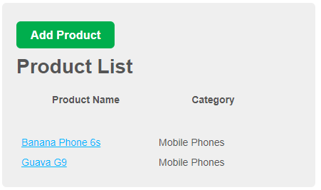
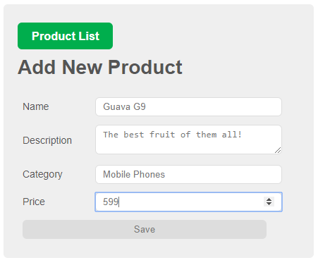
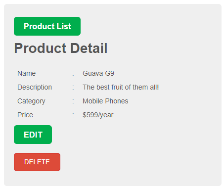

# MEAN-ProductsList

> A basic webapp which builds upon my previous work MEAN_CURD-API. It has CRUD funcionality with basic ejs templating for frontend.


## Screenshots:


> ``/products`` Index of all the products



> ``/add`` Adding new product



> ``/show`` Viewing added product

## Requirements & Set-up

MongoDB
NodeJS
ExpressJS

After putting all files in a folder go to console:
```sh
npm install
mongod
npm start or nodemon
```
